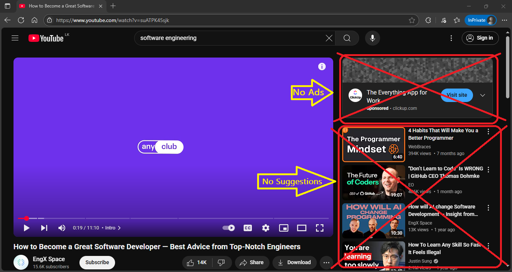
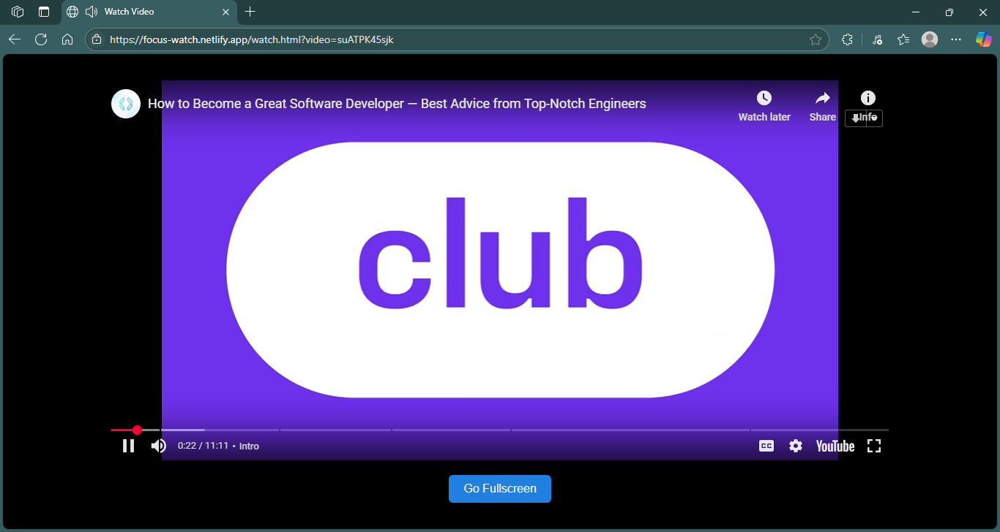

# 🎯 Focus Watch

A distraction-free YouTube video viewer.  
Just paste a YouTube URL, hit "Watch", and enjoy the video without ads, comments, or distracting suggestions.

🌐 **Live Demo**: [focus-watch.netlify.app](https://focus-watch.netlify.app)

---

## ✨ Features

- 🌓 Dark theme interface
- 🎬 Clean, embedded video viewer
- 🔗 Easy YouTube URL input
- 🧘 Focus mode (no recommendations, no distractions)
- 🔳 Full-screen video support

---

## 🚀 How to Use

1. Go to [focus-watch.netlify.app](https://focus-watch.netlify.app)
2. Paste a valid YouTube video URL (e.g., `https://www.youtube.com/watch?v=dQw4w9WgXcQ`)
3. Click **"Watch"**
4. Video opens on a distraction-free page with full-screen support

---

## 🖼️ Screenshots

### 🔸 Home Page – Enter YouTube URL

### 🔸 Video Playback Page – Clean View

---

